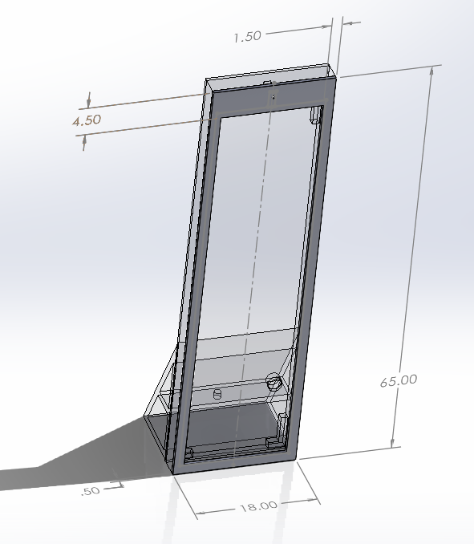

<h2 style="color:#4682B4;"> UBC Sailbot - Electrical Team </h2>

Electrical Team Member at [UBC Sailbot](https://www.ubcsailbot.org/) (Sept 2024 - Present)
#### Navigation - IMU Sensor Development
- description
- description
  
 

 <video width="225" controls>  <source src="assets/UBCSailbot_IMU/imu_eulerdata_printing.mp4" type="video/mp4"> </video>

#### Manufacturing Polaris (Our New Sailboat!)
- While I am on the Electrical team, there are many opportunities to integrate with other teams and work on other project elements such as manufacturing
- Helped with carbon fibre fairing layup
  - Sized and oriented carbon fibre sheets
  - Prepared and applied structural and non-structural epoxy

 <video width="270" controls> <source src="assets/UBCSailbot_PLRS_Layup/carbon_fibre_timelapse.mp4" type="video/mp4"> </video>

 
 
 

<h2 style="color:#4682B4;"> IGEN 330 Capstone Project </h2>

#### Project Description
- Designing an AI Mirror which recommends the user an outfit based on weather and occasion

#### Camera Attachment
- Designed and modelled the parts and assembly for the attachment to mount the camera to the mirror
- Made to be user friendly, with a sliding cover for privacy

<h2 style="color:#4682B4;"> IGEN 230 Capstone Project </h2>

#### Project Description
- Designed self heating and waterproof ski goggles using ITO, polycarbonate, and 3D printed resin
  
#### Heat Element Testing
- Designed 3D CAD models for testing
- Led standardized testing to determine the best material to be used for the heating element of the goggles

#### Waterproof Material Testing
- description
- description

 

 
<h2 style="color:#4682B4;"> IGEN 230 Line Following Robot Project </h2>

#### Circuitry
- Designed and constructed the mehcanical structure necessary for a line-following robot
- Constructed the electrical circuit connecting power, photo-transistors, H-bridge and motors
- Implemented H-Bridge Board 
  - H-Bridge for direction control &rarr; running motors forwards and backwards
  - PWM for speed control &rarr; phototransistor is on when it sees white (detects more light)
  - Developed personal code to complete tracks including turns up to 360 degrees, comprehension of intersections and missing lines
    
 

    /* Analog input, analog output, serial output

  Reads an analog input pin, maps the result to a range from 0 to 255 and uses the result to set the pulse width modulation (PWM) of an output pin.
  Also prints the results to the Serial Monitor.

  The circuit:
  - potentiometer connected to analog pin 0.
    Center pin of the potentiometer goes to the analog pin.
    side pins of the potentiometer go to +5V and ground
  - LED connected from digital pin 9 to ground through 220 ohm resistor

  This example code is in the public domain.
  https://www.arduino.cc/en/Tutorial/BuiltInExamples/AnalogInOutSerial */

// These constants won't change. They're used to give names to the pins used:
const int Ain_pin[5] = {A4, A3, A2, A1, A0};

//values stored directly from the sensor output
int sensor_in[5] = {0,0,0,0,0};

// values after processing to determine if black is being seen
bool sensor_is_blk[5] = {0,0,0,0,0};

//defining pins for the motors
//Right Motor
const int Din1 = 4; 
const int Din2 = 5; 
const int ConA = 3;
//Left Motor
const int Din3 = 7;
const int Din4 = 6; 
const int ConB = 9; 

void setup_sensors() {
  // initialize serial communications at 9600 bps:
  Serial.begin(9600);
}

//This code is to use with L298n Dual H-bridge motor driver
//It just turns on a DC motor for a certain time with a low speed and turn it off then turn on with high speed
//refer to surtrtech.blogspot.com for more information
void setup_motors() {
  pinMode(Din1, OUTPUT); 
  pinMode(Din2, OUTPUT);
  pinMode(Din3, OUTPUT);
  pinMode(Din4, OUTPUT);
  pinMode(ConA, OUTPUT);
  pinMode(ConB, OUTPUT);
}

// Helper functions
void debug_print(int sensor_in[5], bool sensor_is_blk[5]){
Serial.println("---------------------------------------DEBUG----------------------------------------------");
   for (int idx = 0; idx < 5; ++idx){
    Serial.print("sensor");
    Serial.print(idx);
    Serial.print(" = ");
    Serial.print(sensor_in[idx]);
    Serial.print("\t is_black=");
    Serial.println(sensor_is_blk[idx]);
   } Serial.println("-----------------------------------------------------------------------------------------");
}

void sensor_val(bool debug = false) {
  for (int idx = 0; idx < 5; ++idx){
      sensor_in[idx] = analogRead(Ain_pin[idx]);
      sensor_is_blk[idx] = is_black(sensor_in[idx]);
  }
  if (debug){
        debug_print(sensor_in, sensor_is_blk);
      }
}

// functions for querying the sensor inputs
bool is_black (int sensor_input){
  if (sensor_input >= 800){
    return true;
  }
  return false;
}

bool is_matching (bool arg0, bool arg1, bool arg2, bool arg3, bool arg4, bool sensor_inputs[5]){
  // helper function to see if the input array is matching the sensor_inputs array
  bool input[5] = {arg0, arg1, arg2, arg3, arg4};
  bool return_bool = true;
  for (int idx = 0; idx < 5; idx++){
    if (input[idx] != sensor_inputs[idx]){
      return_bool = false;
      break;
    }
  }
  return return_bool;
}

//functions for steering and driving
const int FULL_FWD_SPD = 120;

void full_forwards(){
  leftforwards(FULL_FWD_SPD);
  rightforwards(FULL_FWD_SPD);
  delay(20);
  stop();
}

void full_backwards(){
  left backwards(FULL_FWD_SPD);
  right backwards(FULL_FWD_SPD);
  delay(20);
  stop();
}

void slight_left(){
  rightforwards(FULL_FWD_SPD);
  delay(60);
  leftforwards(FULL_FWD_SPD);
  delay(30);
  stop();
}

void slight_right(){
  leftforwards(FULL_FWD_SPD);
  delay(60);
  rightforwards(FULL_FWD_SPD);
  delay(30);
  stop();
}

void full_left(){
  stop();
  rightforwards(FULL_FWD_SPD);
  delay(500);
  rightoff();
  stop();
  delay(500);
}

void full_right(){
  stop();
  leftforwards(FULL_FWD_SPD);
  delay(500);
  leftoff();
  stop();
  delay(500);
}

void stop(){
  rightoff();
  leftoff();
}

// low level functions for movement
void rightforwards(int speed){
  digitalWrite(Din1, LOW);
  digitalWrite(Din2, HIGH);
  analogWrite(ConA, FULL_FWD_SPD);
}

void leftforwards(int speed){
  digitalWrite(Din3, LOW);
  digitalWrite(Din4, HIGH);
  analogWrite(ConB, FULL_FWD_SPD);
}

void rightbackwards(int speed){
  digitalWrite(Din1, HIGH);
  digitalWrite(Din2, LOW);
  analogWrite(ConA, FULL_FWD_SPD);
}

void leftbackwards(int speed){
  digitalWrite(Din3, HIGH);
  digitalWrite(Din4, LOW);
  analogWrite(ConB, FULL_FWD_SPD);
}

void rightoff(){
  digitalWrite(Din1, LOW);
  digitalWrite(Din2, LOW);
  analogWrite(ConA, 0);
}

void leftoff(){
  digitalWrite(Din3, LOW);
  digitalWrite(Din4, LOW);
  analogWrite(ConB, 0);
}

void steering(){
  //takes the current values from sensor_is_blk array and conducts steering accordingly
  if (is_matching(0, 0, 1, 0, 0, sensor_is_blk) || is_matching(1,1,1,1,1, sensor_is_blk) || is_matching(0,0,0,0,0, sensor_is_blk) || is_matching(0,1,1,1,0, sensor_is_blk)){
    full_forwards();
    Serial.println("DEBUG: steering() -> straight forwards");
    debug_print(sensor_in, sensor_is_blk);
  } else if (is_matching(0,1,1,0,0, sensor_is_blk) || is_matching(0,1,0,0,0, sensor_is_blk) || is_matching(1,0,0,0,0, sensor_is_blk)){
    slight_left();
    Serial.println("DEBUG: steering() -> slight left");
    debug_print(sensor_in, sensor_is_blk);
  } else if (is_matching(0,0,1,1,1, sensor_is_blk) || is_matching(0,0,0,1,0, sensor_is_blk) || is_matching(0,0,0,0,1, sensor_is_blk)){
    slight_right();
    Serial.println("DEBUG: steering() -> slight right");
    debug_print(sensor_in, sensor_is_blk);
  } else if (is_matching(1,1,1,0,0, sensor_is_blk) || is_matching(1,1,0,0,0, sensor_is_blk)){
    full_left();
    Serial.println("DEBUG: steering() -> full left");
    debug_print(sensor_in, sensor_is_blk);
  } else if (is_matching(0,0,1,0,1, sensor_is_blk) || is_matching(0,0,0,1,1, sensor_is_blk)){
    full_right();
    Serial.println("DEBUG: steering() -> full right");
    debug_print(sensor_in, sensor_is_blk);
  } else {
    full_forwards();
    delay(10);
    full_backwards();
    delay(10);
    Serial.print("UNHANDLED CASE - DEBUG: steering() -> straight forwards -> straight back");
    debug_print(sensor_in, sensor_is_blk);
  }
}
// Arduino Functions (caller side)
void setup(){
  setup_sensors();
  setup_motors();
}

void loop() {
  // write to sensor_in and sensor_is_blk arrays
  sensor_val(false);
  steering();
  delay(20);
}

[Arduino Code](/assets/code_track34.txt)

 
 
 

