<h2 style="color:#4682B4;"> UBC Sailbot - Electrical Team </h2>

Electrical Team Member at [UBC Sailbot](https://www.ubcsailbot.org/) (Sept 2024 - Present)
#### Navigation - IMU Sensor Development
- description
- description
  
 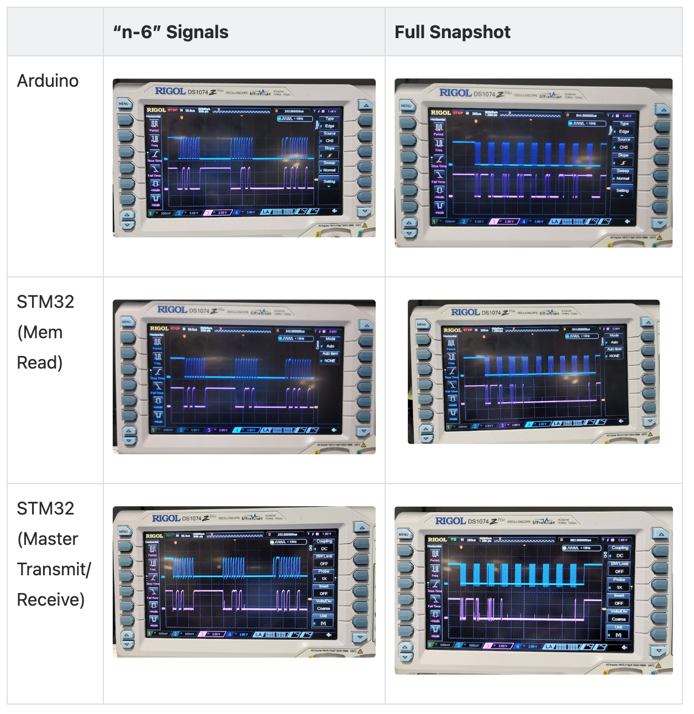

 
<video width="210" controls>
  <source src="assets/imu_eulerdata_printing_updated.mp4" type="video/mp4">
</video>

#### Manufacturing Polaris (Our New Sailboat!)
- While I am on the Electrical team, there are many opportunities to integrate with other teams and work on other project elements such as manufacturing
- Helped with carbon fibre fairing layup
  - Sized and oriented carbon fibre sheets
  - Prepared and applied structural and non-structural epoxy

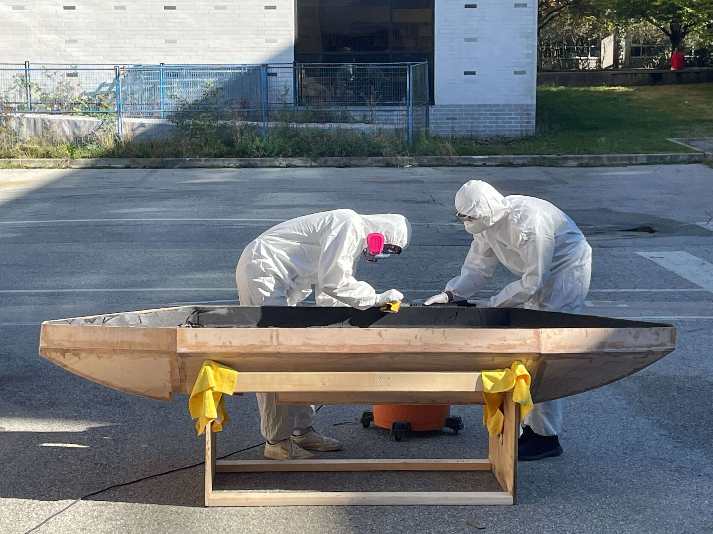 

<video width="210" controls>
  <source src="assets/carbon_fibre_timelapse.mp4" type="video/mp4">
</video>

 
 
 

<h2 style="color:#4682B4;"> IGEN 330 Capstone Project </h2>

#### Project Description
- Designing an AI Mirror which recommends the user an outfit based on weather and occasion

#### Camera Attachment
- Designed and modelled the parts and assembly for the attachment to mount the camera to the mirror
- Made to be user friendly, with a sliding cover for privacy

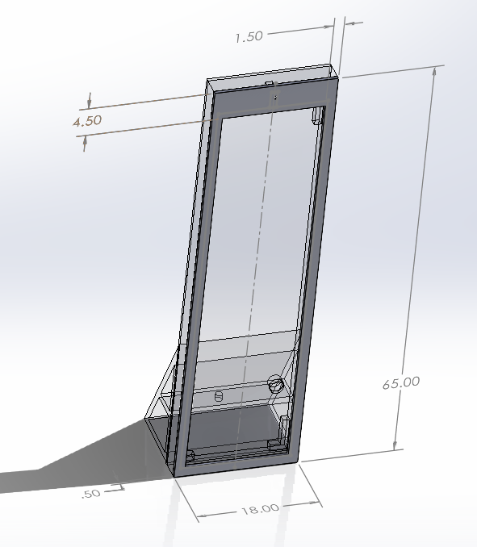
 
<h2 style="color:#4682B4;"> IGEN 230 Line Following Robot - Individual Project </h2>

#### Circuitry
- Designed and constructed the mehcanical structure necessary for a line-following robot
- Constructed the electrical circuit connecting power, photo-transistors, H-bridge and motors
- Implemented H-Bridge Board 
  - H-Bridge for direction control &rarr; running motors forwards and backwards
  - PWM for speed control &rarr; phototransistor is on when it sees white (detects more light)
  - Developed personal code to complete tracks including turns up to 360 degrees, comprehension of intersections and missing lines
    
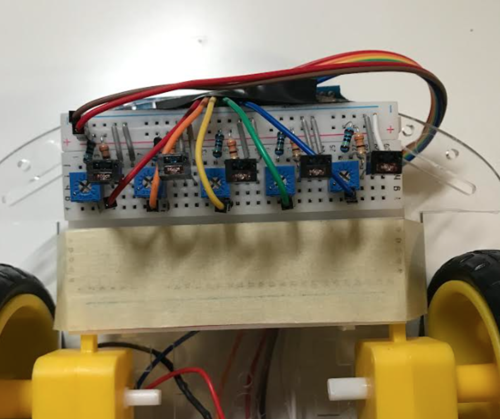 
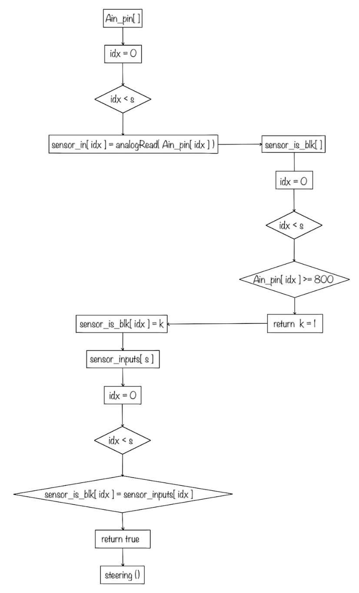

[Arduino Code](/assets/code_track34.txt)

 
 
 

<h2 style="color:#4682B4;"> IGEN 230 Capstone Project </h2>

#### Project Description
- Designed self heating and waterproof ski goggles using ITO, polycarbonate, and 3D printed resin
#### Heat Element Testing
- Designed 3D CAD models for testing
- Led standardized testing to determine the best material to be used for the heating element of the goggles
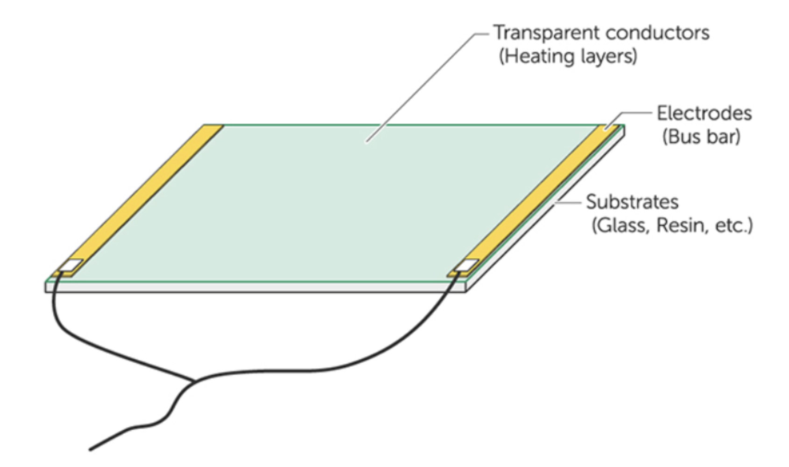

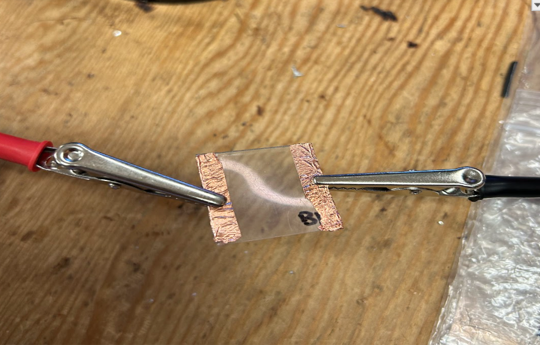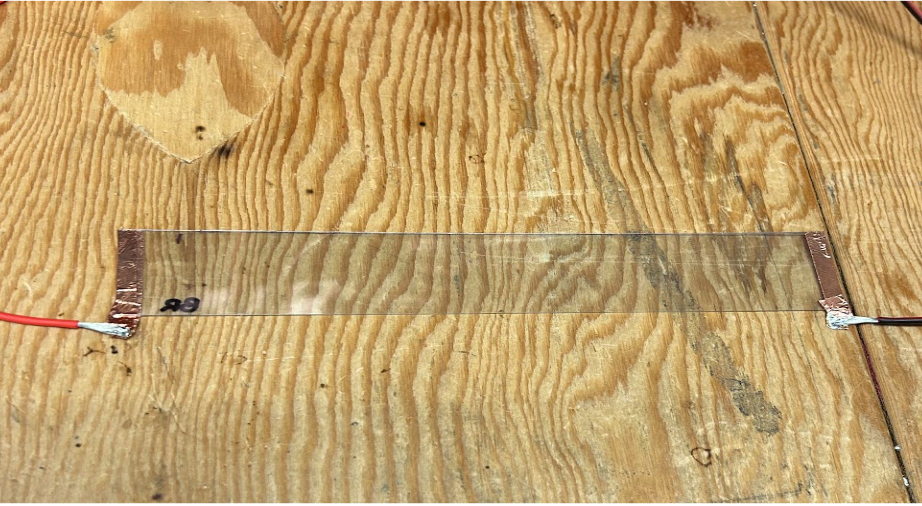

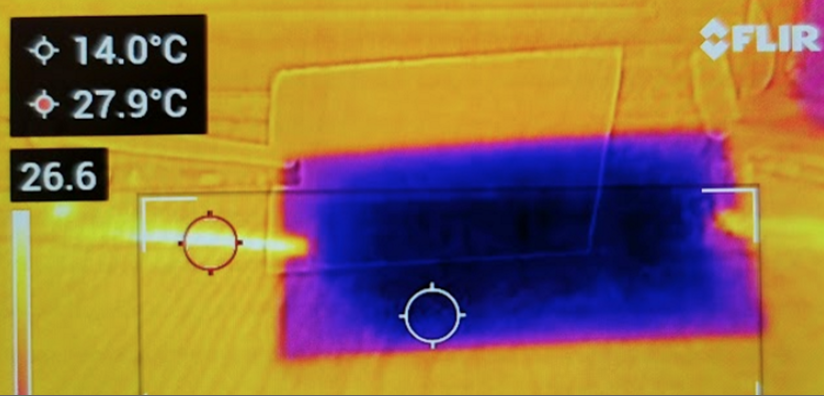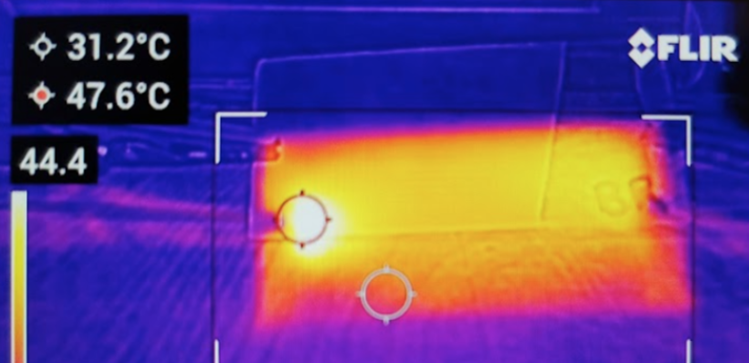

#### Waterproof Material Testing
- Tested ______
- tfiafoiaf

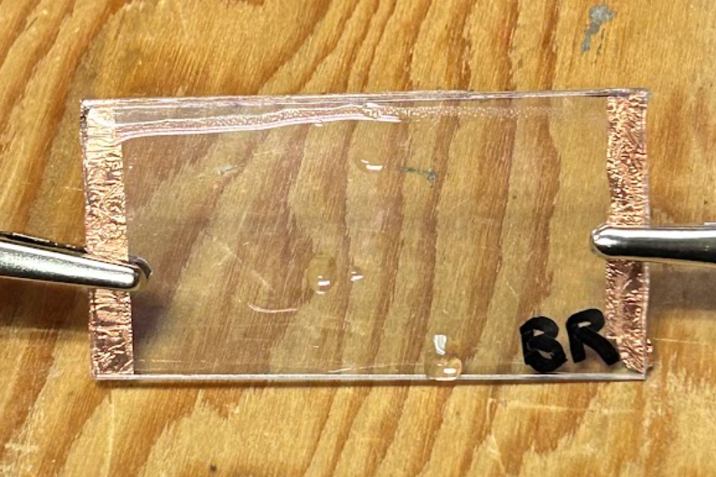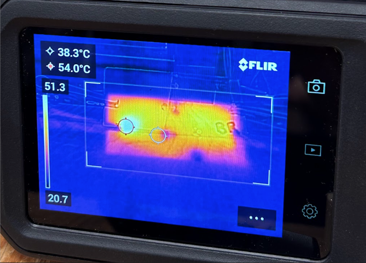
