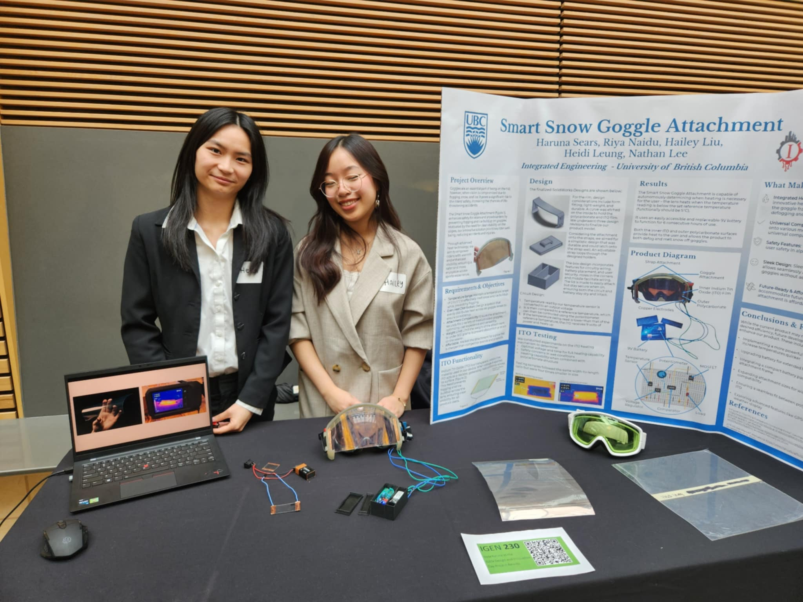

<h2 style="color:#4682B4;"> UBC Sailbot - Electrical Team </h2>

Electrical Team Member at [UBC Sailbot](https://www.ubcsailbot.org/) (Sept 2024 - Present)
#### Navigation - IMU Sensor Development
- responsible for displaying boat heading at all times for navigation
- programmed and tested code through I2C peripheral using an oscilloscope, Arduino Uno Rev3 and STM32 U575
- programmed code for proper calibration and exception handling 
- developed and executed testing procedures for IMU limitations in simulated environments
- in-progress project

 <video width="225" controls>  <source src="assets/UBCSailbot_IMU/imu_eulerdata_printing.mp4" type="video/mp4"> </video>

#### Manufacturing Polaris (Our New Sailboat!)
- While I am on the Electrical team, there are many opportunities to integrate with other teams and work on other project elements such as manufacturing
- Helped with carbon fibre fairing layup
  - Sized and oriented carbon fibre sheets
  - Prepared and applied structural and non-structural epoxy

 <video width="270" controls> <source src="assets/UBCSailbot_PLRS_Layup/carbon_fibre_timelapse.mp4" type="video/mp4"> </video>

 
 

<h2 style="color:#4682B4;"> IGEN 330 Capstone Project </h2>

#### Project Description
- Designing an AI Mirror which recommends the user an outfit based on weather and occasion
- in-progress project

#### Camera Attachment
- Designed and modelled the parts and assembly for the attachment to the camera
- Made to be user friendly, with a sliding cover for privacy

           

#### Mirror Frame
- Designed and modelled the parts and assembly for the mirror frame
- Suited for woodworking; composed of four layers (front panel, middle panel, supports, back panel) + stand
- Front and middle panel provide an extruded edge for the mirror to sit on top
- Stand designed for internal wiring and allocated storage 

      
 

 
 

<h2 style="color:#4682B4;"> IGEN 230 Capstone Project </h2>

#### Project Description
- Designed self heating and waterproof ski goggles using ITO, polycarbonate, and 3D printed resin
  
#### Heat Element Testing
- Developed testing method 
- Led standardized testing to determine the best ratio of material to be used for the heating element of the goggles

         

#### Environment Temperature Testing
- Developed testing method 
- Led standardized testing to determine the effect of starting temperature on the heating element of the goggles

#### Waterproof Material Testing
- Developed testing method 
- Led standardized testing to determine the effect of water on the heating element of the goggles

#### Design and Innovation Day (DAID)
- Showcased capstone projects to the general public
- Explanation and description of design process and key iterations
- Demonstration of product

           

 
 
 
<h2 style="color:#4682B4;"> IGEN 230 Line Following Robot Project </h2>

#### Project Description
- Designed and constructed the mehcanical structure necessary for a line-following robot
- Constructed the electrical circuit connecting power, photo-transistors, H-bridge and motors
- Implemented H-Bridge Board 
  - H-Bridge for direction control &rarr; running motors forwards and backwards
  - PWM for speed control &rarr; phototransistor is on when it sees white (detects more light)
  - Developed personal code to complete tracks including turns up to 360 degrees, comprehension of intersections and missing lines

 
<video width="480" controls><source src="assets/IGEN230_LineFollowingRobot/track1.mp4" type="video/mp4"></video>                                
<video width="225" controls><source src="assets/IGEN230_LineFollowingRobot/track2_forwards.mp4" type="video/mp4"></video> <video width="225" controls><source src="assets/IGEN230_LineFollowingRobot/track2_backwards.mp4" type="video/mp4"></video>                    

[Arduino Code - Click Here!](/assets/IGEN230_LineFollowingRobot/code_track34.txt)

 
 
 

